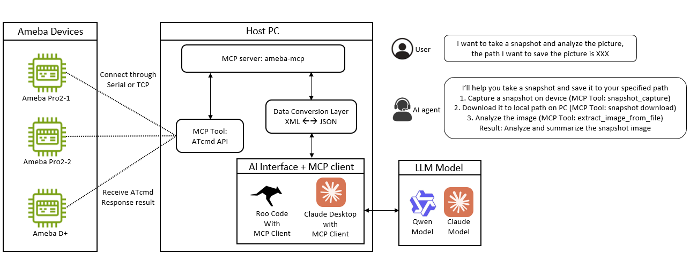
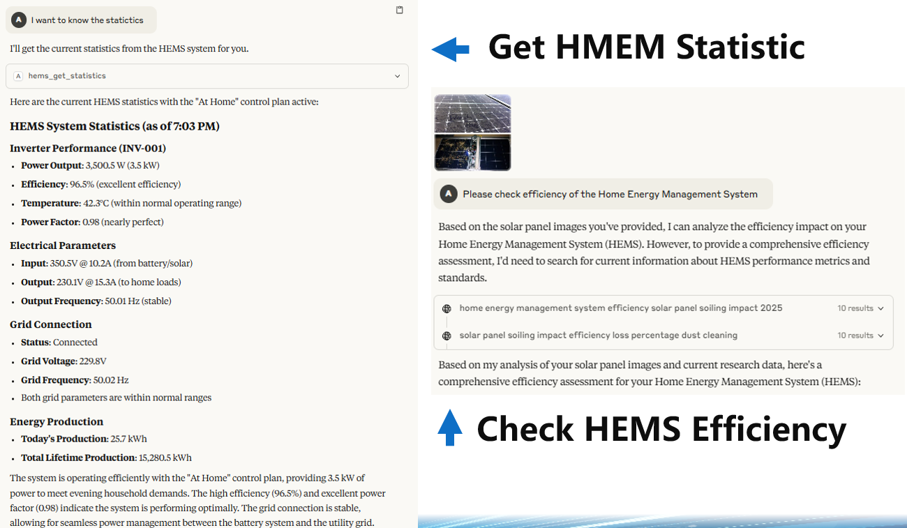
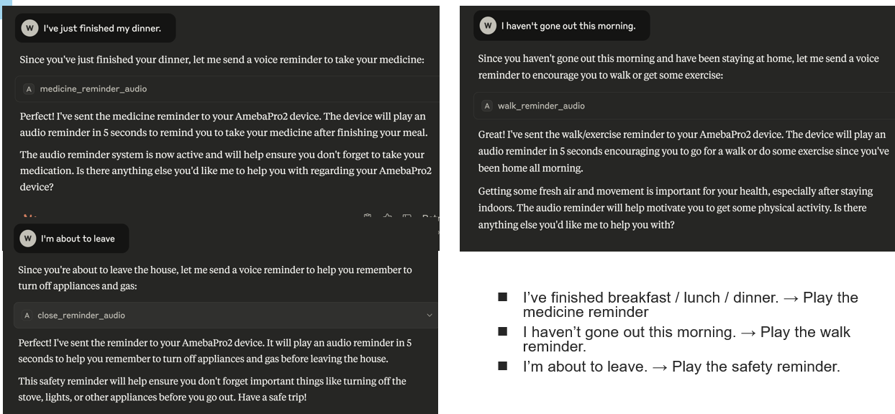

# Ameba MCP Server

A Model Context Protocol (MCP) server for controlling Ameba IoT development boards. This server provides a unified interface for interacting with multiple Ameba product lines including Ameba Pro2 and Ameba D Plus.


## System Architecture


### Example: Energy Management


### Example: Healthcare



## Prerequisites

- Python 3.10 or higher
- [UV](https://github.com/astral-sh/uv) package manager
- Ameba development board
- USB cable (for serial connection)
- Network connection (for TCP connection)

## Installation

### 1. Install UV on Windows

```bash
# On Windows
PowerShell 安裝
powershell -c "irm https://astral.sh/uv/install.ps1 | iex"
 
驗證安裝
uv --version
 
用uv安裝環境 (For Claude Desktop, we don't need to execute this step, it will automatically install the environment according to claude_desktop_config.json)
cd D:\path\to\ameba-mcp
uv venv --python 3.10
.venv\Scripts\activate
uv pip install -e . (the dependencies is written in pyproject.toml)

```

### 2. Project Structure

```bash
ameba-mcp/                                    
├── README.md                               
├── LICENSE                                   
├── .gitignore                               
├── images/                                  
│   └── architecture.png                    
└── src/                                     # Source code directory
    ├── ameba-mcp-server/                    # Ameba MCP Server
    │   ├── pyproject.toml                   # Python project configuration
    │   ├── uv.lock                          # Dependency lock file
    │   ├── README.md                        # Server documentation
    │   ├── .gitignore                      
    │   └── api/                                 
    │       ├── core.md                          
    │       ├── wifi.md                          
    │       ├── snapshot.md                      
    │       ├── kvs.md                           
    │       └── hems.md                          
    │   ├── ameba_aiot/                      # Python package directory
    │   │   ├── __init__.py                  # Package initialization
    │   │   └── ameba_mcp_server/            # MCP Server implementation
    │   │       ├── server.py                # MCP Server main program
    │   │       ├── modules/                 # Feature modules
    │   │       │   ├── __init__.py          
    │   │       │   ├── connection_manager.py # Connection module
    │   │       │   ├── connection_module.py 
    │   │       │   ├── feature_module.py    # Base module Class
    │   │       │   ├── wifi_module.py       # WiFi functionality module
    │   │       │   ├── snapshot_module.py   # Snapshot functionality module
    │   │       │   ├── kvs_module.py        # KVS streaming module
    │   │       │   ├── hems_module.py       # HEMS functionality module
    │   │       │   ├── healthcare_module.py # Healthcare functionality module
    │   ├── .venv/                          # Virtual environment (git ignored)
    │
    ├── another-mcp-server/                  # Future additional MCP servers
    │   ├── pyproject.toml
    │   └── ...

```

## Available MCP Servers

| Server Name | Description |
|-------------|-------------|
| [Ameba MCP Server](src/ameba-mcp-server) |  A Model Context Protocol (MCP) server for controlling Ameba IoT development boards through serial or tcp. This server provides a unified interface for interacting with multiple Ameba product lines including Ameba Pro2 and Ameba D Plus.
| [Wifi Diagnostic MCP Wrapper](src/wifi-diagnostic-mcp-wrapper) | A Model Context Protocol (MCP) server including MQTT protocol provide to MCP wrapper. MCP wrapper will wraps a STDIO-based MCP (Model Context Protocol, this example) server and exposes it as an HTTP endpoint by JSONRPC 2.0. Therefore, this MCP server is written in JSON RPC 2.0 format
